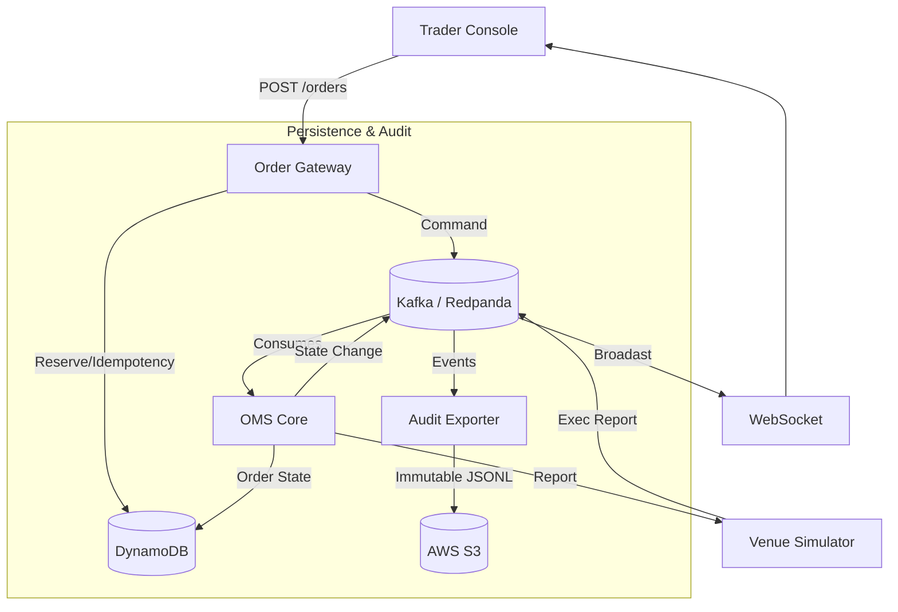

# ATLAS: Production-Grade Trading Platform Architecture

ATLAS is an event-driven trading platform evolved with a resilient, production-shaped infrastructure.

## System Architecture

### Hot Path vs. Cold Path

1. **Hot Path (Kafka)**: The event backbone. Stores "WHAT HAPPENED" in real-time. Crucial for decoupling, ordering guarantees, and low-latency state transitions.
2. **Current State (DynamoDB)**: Authoritative store for "WHAT IS TRUE NOW". Stores latest balances and order statuses. Enables fast, restart-safe recovery of operational state.
3. **Cold Path (S3)**: The "WHAT HAPPENED FOREVER" immutable archive. Used for regulatory compliance, post-mortem debugging, and data lake ingestion.

### Why DynamoDB is State, Not History
DynamoDB holds the "Point-in-Time" truth. It doesn't track every individual change to a balance, only the current number. This keeps queries fast and predictable. The history is kept in Kafka (short-term) and S3 (long-term).

### Why S3 is Append-Only Audit
S3 provides durable, low-cost storage for massive amounts of data. By writing events in JSONL format, we create a tamper-proof record. Once a file is written to S3, it is never changed, only supplemented by new files.

### Future Snowflake Ingestion
Snowflake can easily ingest the partitioned JSONL files from S3 using `SNOWPIPE` or `EXTERNAL STAGES`. This allows analysts to run complex SQL queries over years of trading history without impacting the live trading system.

## Setup & Infrastructure

1. **Backend Persistence**: Integrated with AWS DynamoDB (Local or Cloud).
2. **Audit Pipeline**: Standalone `audit-exporter` service archives all events to S3.
3. **Infrastructure as Code**: Terraform templates provided under `infra/terraform/aws/` for reproducible provisioning.
