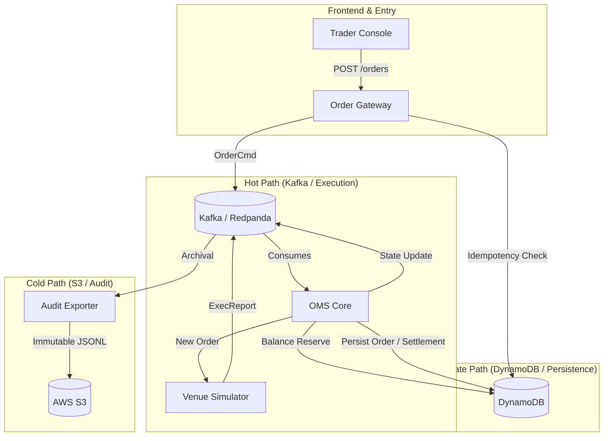

# 1️⃣ ATLAS — Advanced Trading Lifecycle & Audit System

**Advanced Trading Lifecycle & Audit System**

## 2️⃣ High-Level Description

ATLAS is a production-shaped trading platform designed to manage the full lifecycle of an order—from entry and validation to execution and immutable archival. It demonstrates how modern financial systems maintain high availability and data integrity using event-driven architecture. For non-technical stakeholders, ATLAS is a simulation of a professional trading environment that ensures every dollar and every trade is tracked, verified, and never lost, even if the system restarts.

For trading technology engineers, ATLAS is a distributed system built on **Kafka semantics** for asynchronous execution and **AWS DynamoDB** for authoritative state persistence. It implements a "triple-path" architecture (Hot, State, and Cold paths) to decouple the high-frequency execution engine from the persistent ledger and the long-term audit lake. This ensures that the system can handle bursts of trading activity while maintaining strict idempotency and ledger safety.

## 3️⃣ Project Goals

*   **Demonstrate Event-Sourcing Patterns**: Illustrate how Kafka serves as the backbone for state transitions and service decoupling.
*   **Production-Grade Persistence**: Model authoritative state management using NoSQL (DynamoDB) with conditional updates to prevent race conditions.
*   **Immutable Auditing**: Implement a regulatory-compliant audit trail by exporting every system event to S3 in an append-only format.
*   **Infrastructure as Code**: Define the entire cloud environment (S3, DynamoDB, IAM) via Terraform for reproducible deployments.
*   **Resilient Lifecycle Management**: Show how an order moves through various states (NEW, LIVE, FILLED) with crash-safe recovery.

## 4️⃣ High-Level Architecture Diagram (Mermaid)



## 5️⃣ Three Data Paths Explained

### ⚡ Hot Path (Execution)
*   **What problem it solves**: Eliminates performance bottlenecks caused by synchronous database writes in high-frequency environments.
*   **Why it exists**: Trading systems require immediate acknowledgement of order entry and rapid state transitions that cannot wait for disk I/O or distributed locks on a relational database.
*   **Real-world Mapping**: Matches the high-speed matching engines and execution gateways used in electronic exchanges (LSEG, NASDAQ).

### 🏛️ State Path (Operational)
*   **What problem it solves**: Provides a restart-safe "Source of Truth" for current system state without replaying the entire history of events.
*   **Why it exists**: Services must be able to fail and recover instantly. By offloading current balances and order statuses to an authoritative NoSQL store, services remain functionally stateless.
*   **Real-world Mapping**: Functions as the Real-Time Risk Manager (RTRM) and Margin Engine found in institutional prime brokerage platforms.

### ❄️ Cold Path (Audit)
*   **What problem it solves**: Decouples historical data storage from operational performance, ensuring that long-term archival does not impact trading latency.
*   **Why it exists**: Regulatory mandates (e.g., CAT, MiFID II) require immutable proof of trade execution. S3 provides a cost-effective, durable, and tamper-proof storage layer.
*   **Real-world Mapping**: Represents the Compliance Data Lake or Regulatory Reporting Hub used for surveillance and post-trade analytics.

## 6️⃣ End-to-End Order Lifecycle

1.  **Entry**: The **Trader Console** submits an order via `POST /orders` to the **Order Gateway**.
2.  **Validation**: The Gateway verifies the `RequestID` in **DynamoDB** to ensure idempotency.
3.  **Instruction**: The Gateway publishes an `OrderCommand` to the **Kafka** execution bus.
4.  **Reservation**: The **OMS Core** consumes the command and reserves the trader's balance in **DynamoDB** using conditional updates.
5.  **Execution**: The OMS routes the order to the **Venue Simulator** for matching.
6.  **Reporting**: The Venue emits an `ExecutionReport` back to the Kafka bus once the order is matched.
7.  **Settlement**: The OMS consumes the report, updates the final order status, and settles the balance in DynamoDB.
8.  **Feedback**: The system broadcasts the state change via WebSockets back to the **Trader Console**.

## 7️⃣ Kafka & Redpanda Section

ATLAS architecturally uses **Kafka** as its distributed ledger and communication backbone. This ensures:
*   **Strict Ordering**: Events are processed in the exact order they are received.
*   **Replayability**: The system state can be reconstructed by replaying the event log.
*   **Decoupling**: The OMS does not need to know about the Audit Exporter; both simply consume from the stream.

For local development and demo purposes, we utilize **Redpanda**. It is a C++ based, Kafka-compatible streaming platform that provides the same API and semantics as Kafka but with significantly reduced operational overhead (no Zookeeper/JVM required), making it the production-grade choice for this architecture's demo mode.

## 8️⃣ Tech Stack Table

| Component | Technology |
| :--- | :--- |
| **Frontend** | React, Next.js, Tailwind CSS |
| **Backend** | Go (Golang) |
| **Streaming** | Kafka / Redpanda |
| **State** | AWS DynamoDB |
| **Audit** | AWS S3 |
| **Infrastructure** | Terraform |
| **Observability** | OpenTelemetry, Prometheus |

## 9️⃣ Repository Structure

```text
.
├── apps/               # Next.js Trading Console UI
├── services/           # Backend Go Microservices
│   ├── order-gateway/  # API entry, validation, & idempotency
│   ├── oms-core/       # Execution logic & state persistence
│   ├── venue-sim/      # Exchange simulation matching engine
│   └── audit-exporter/ # S3 Archival logic
├── infra/              # Terraform (Cloud) & Docker Compose (Local)
├── schemas/            # Unified data models (Protobuf/JSON)
└── scripts/            # Build, test, and AWS verification scripts
```

## 🔟 Running the Project

### Local Mode
Starts Redpanda, DynamoDB-Local, and all backend services in a unified environment.
```bash
make -C infra up
```

### Backend Services
To run individual services for debugging:
```bash
cd services/oms-core && go run main.go
```

### Frontend Console
```bash
cd apps/atlas-console && npm run dev
```

### 🌐 Public Demo Mode (Vercel)
ATLAS includes a zero-dependency **Demo Mode** designed specifically for public previews and Vercel deployments.
*   **Top-Right Toggle**: Switch between **Demo** (In-browser Engine) and **Live** (WebSocket API).
*   **In-Browser Engine**: Simulates a live Kafka-stream, order matching, and balance reservation entirely in the frontend.
*   **Persistence**: Your demo portfolio and order history are saved to `localStorage`, allowing for persistent simulation across sessions.
*   **Zero Backend Required**: This mode allows anyone to experience the ATLAS trading lifecycle without needing to provision AWS resources or run Kafka locally.

## 1️⃣1️⃣ Cloud / Hybrid Mode

ATLAS is designed for a **Hybrid Deployment** model. While the high-speed execution path can run in a local VPC, the persistence and audit layers are managed by AWS.

*   **Terraform**: Use the provided HCL files to provision `atlas_orders`, `atlas_balances`, and the `atlas-audit` S3 bucket.
*   **Hybrid Logic**: This separation mirrors real-world institutional setups where execution proximity to the exchange is critical, but data durability is offloaded to managed cloud providers.

## 1️⃣2️⃣ Demo vs Production Disclaimer

**ATLAS is an architectural prototype, not a production-ready matching engine.**
*   **Demo Mode**: Uses a simplified internal matching loop within the Venue Simulator.
*   **Production Gaps**: A full production system would require hardware-level TCP/IP offloading (Kernel Bypass), FPGA-based matching, and strict sub-microsecond latency optimizations.
*   **Realism**: The **data flow, persistence strategies, and architectural boundaries** are identical to those used in modern production-grade trading systems.

## 1️⃣3️⃣ Key Design Guarantees

*   **Idempotency**: Prevents "double-spend" or duplicate orders caused by network retries.
*   **Balance Safety**: Conditional writes ensure account balances never drop below zero.
*   **Restart Safety**: Services recover state from DynamoDB and resume Kafka consumption without data loss.
*   **Audit Immutability**: Write-once policies on S3 guarantee an auditable, tamper-proof history.

## 1️⃣4️⃣ Author Section

**Ujjwal Bana**  
*System Analyst | Infrastructure & Data Architecture*
